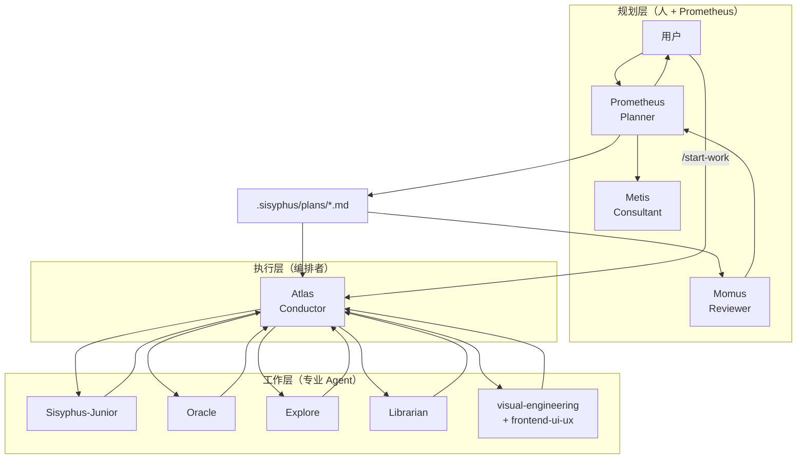

# 第二章：整体架构与多模型编排机制

本章把 oh-my-openagent（OmO）整体看一遍：从你按下回车那一刻开始，请求是怎么经过 IntentGate、被 Sisyphus 拆解、转给 Category-based 子智能体、最后通过 Hashline 工具改到你的代码里的——同时还要兼顾后台 Agent、Skill 注入、52 个 Hook 拦截、MCP 调用，以及多模型 fallback 链。

理解完本章，你才能在后面看任何一个具体特性的时候，知道它在整张图里的位置。

---

## 2.1 从用户请求到完成代码：一次完整的请求流

OmO 的核心调用链可以画成下面这张图（这是一份手绘版的"管线总览"，请逐步读）：

```
┌──────────────────────────────────────────────────────────────────────┐
│ 用户在 OpenCode 里键入                                               │
│   ┌────────────────────────────────────────────────────────────┐     │
│   │ "ulw 给登录接口加上手机号验证码登录"                       │     │
│   └────────────────────────────────────────────────────────────┘     │
└──────────────────────────────────────────────────────────────────────┘
                              │
                              ▼
┌──────────────────────────────────────────────────────────────────────┐
│ keyword-detector Hook                                                │
│   - 嗅探到 "ulw" / "ultrawork" 关键词                                │
│   - 切换会话进入 ultrawork 模式                                      │
│   - 同时识别 "search/find/analyze" 等关键词                          │
└──────────────────────────────────────────────────────────────────────┘
                              │
                              ▼
┌──────────────────────────────────────────────────────────────────────┐
│ IntentGate（意图门）                                                 │
│   - 分类用户的"真实意图"：研究 / 实现 / 调查 / 修复 / 重构…           │
│   - 不是字面解析，而是先做意图判断，避免被表层措辞带偏                │
└──────────────────────────────────────────────────────────────────────┘
                              │
                              ▼
┌──────────────────────────────────────────────────────────────────────┐
│ Sisyphus（主指挥官）                                                  │
│   - 制定计划、todo 列表                                              │
│   - 调用 task() / call_omo_agent() 并行下发子任务                   │
│   - 决定走 Category 还是直接 subagent_type                           │
└──────────────────────────────────────────────────────────────────────┘
                              │
       ┌──────────────────────┼──────────────────────────────┐
       ▼                      ▼                              ▼
┌──────────────┐     ┌────────────────┐            ┌────────────────────┐
│ Explore      │     │ Librarian      │            │ Category 路由      │
│ 代码 grep    │     │ 文档/OSS 检索  │            │ visual-engineering │
│ 后台并发     │     │ 后台并发       │            │ ultrabrain / deep  │
│ MiniMax HS   │     │ MiniMax        │            │ artistry / quick…  │
└──────────────┘     └────────────────┘            └────────────────────┘
                                                            │
                                                            ▼
                                              ┌──────────────────────────┐
                                              │ Sisyphus-Junior          │
                                              │ 按 Category 选模型       │
                                              │ 加载 load_skills 注入    │
                                              │ 调用 26 个工具中的若干   │
                                              └──────────────────────────┘
                                                            │
                                                            ▼
                                              ┌──────────────────────────┐
                                              │ Hashline 编辑             │
                                              │ LSP / AST-Grep            │
                                              │ Tmux 交互终端             │
                                              │ MCP（websearch/grep_app/  │
                                              │      context7 + Skill 内嵌)│
                                              └──────────────────────────┘
                                                            │
                                                            ▼
                                              ┌──────────────────────────┐
                                              │ 验证与回收                │
                                              │ - lsp_diagnostics         │
                                              │ - todo-continuation       │
                                              │ - comment-checker         │
                                              │ - runtime-fallback (容错) │
                                              └──────────────────────────┘
                                                            │
                                                            ▼
                                              ┌──────────────────────────┐
                                              │ 把结果回传给 Sisyphus     │
                                              │ - Wisdom Accumulation     │
                                              │ - 更新 todo / boulder     │
                                              │ - 决定继续还是收尾        │
                                              └──────────────────────────┘
```

每一个方框背后都对应着 OmO 真实存在的一组源码模块：

- 26 个工具分布在 `src/tools/{name}/`，注册在 `src/plugin/tool-registry.ts`；
- 52 个 Hook 分布在 `src/hooks/{name}/`，按照 `Core(43) + Continuation(7) + Skill(2)` 的三层结构组合；
- 11 个智能体在 `src/agents/builtin-agents/`；
- 3 个内置 MCP（websearch / context7 / grep_app）在 `src/mcp/`。

后续章节会逐一深入，本章只关心**整张地图**。

---

## 2.2 三层架构：Planning / Execution / Worker

如果把 OmO 抽象成组织结构，它本质上是一个**三层架构**：



这套三层架构刻意做了**规划与执行的物理隔离**：

- **规划层**：Prometheus（计划员）先和你访谈、调研代码库、产出 Markdown 计划；Metis 在计划落盘前做"缺口分析"（GAP analysis），防止 Prometheus 自己脑补的隐含信息没写出来；Momus 在用户开启高准确度模式时做严格审查，按 Clarity / Verification / Context / Big Picture 四个维度打分。
- **执行层**：Atlas 是"指挥棒"，**自己不写代码**，但负责读计划、拆 todo、累积经验（Wisdom Accumulation）、把任务派给最合适的子 Agent、独立验证结果。
- **工作层**：Sisyphus-Junior 是被 Category 召唤出来的执行小弟，**不能再继续委派**，必须自己干完。Oracle / Explore / Librarian / Multimodal-Looker 是只读的咨询/检索/视觉小组。

这种"计划员不会写代码、执行员不会自己写代码、工作员不能再分包"的设计，看起来有点笨重，但带来一个非常重要的特性：**信息以计划文件 + 笔记本（notepad）为单位被持久化**，会话崩了、机器重启了、隔了一周才回来，进度都不会丢。

---

## 2.3 IntentGate：动手前先过脑子

OmO 的所有请求都会先经过 IntentGate（意图门）。它做一件事：**判断你真正想要的是什么。**

举个例子，你写：

> "为什么这个登录接口偶发 500？"

字面意思是问问题，但你其实想要一次完整的调查 + 修复。Claude Code 这类单 Agent 系统会就着字面意思先去回答几句，然后再问你是不是要修。OmO 的 IntentGate 会把它直接分类成 `investigation + fix`，于是 Sisyphus 一上来就并行启动 Explore（去 grep 调用栈）+ Librarian（查相似 issue）+ Oracle（架构咨询），跑完调查再交给 Junior 修。

IntentGate 解决的是 **AI 编程里最高频的隐性失败点**：被字面意思误导。它对应在源码里就是 IntentGate 分类器和 `keyword-detector` Hook 的组合。

---

## 2.4 Category 系统：按"任务种类"分配模型

### 2.4.1 为什么不直接选模型？

如果让 Sisyphus 在派任务时直接写"用 GPT-5.4 做这个"，会发生两件糟糕的事：

1. **认知偏差**：模型知道自己是"GPT-5.4"，会按它对自己的认知去回答，限制反而被强化；
2. **维护噩梦**：明天 GPT-5.5 出来了，你要把代码里所有 `"gpt-5.4"` 改一遍，还要改回退链。

OmO 的解决方法是引入**类别（Category）**：Sisyphus 只描述"我要哪种工作"，框架自动决定用什么模型。

### 2.4.2 内置 8 个类别

| Category | 默认模型 | 适用场景 |
| --- | --- | --- |
| `visual-engineering` | `google/gemini-3.1-pro high` | 前端、UI/UX、设计、动画、样式 |
| `ultrabrain` | `openai/gpt-5.4 xhigh` | 复杂硬核逻辑、架构决策、需要深度推理的问题 |
| `deep` | `openai/gpt-5.4 medium` | 目标导向的自主调研与执行，"硬骨头"问题 |
| `artistry` | `google/gemini-3.1-pro high` | 创意性/艺术性强的任务，需要新颖想法 |
| `quick` | `openai/gpt-5.4-mini` | 单文件改动、修错字、简单修改 |
| `unspecified-low` | `anthropic/claude-sonnet-4-6` | 不属于其他类别、低投入 |
| `unspecified-high` | `anthropic/claude-opus-4-7 max` | 不属于其他类别、高投入 |
| `writing` | `kimi-for-coding/k2p5` 或 `google/gemini-3-flash` | 文档、技术写作 |

每一个 Category 都有一条**fallback 链**，主模型不可用时自动顺次降级。例如 `deep` 的回退顺序是：`gpt-5.4 → claude-opus-4-7 → gemini-3.1-pro`；`quick` 的回退顺序是：`gpt-5.4-mini → claude-haiku-4-5 → gemini-3-flash → minimax-m2.7 → gpt-5-nano`。

### 2.4.3 Category + Skill 组合的能力

Category 决定模型，Skill 决定**外挂的领域知识 + 工具**。两者组合后，等于"一个最优模型 + 一份领域专长"。例如：

- The Designer：`category = visual-engineering` + `load_skills = ["frontend-ui-ux", "playwright"]` → 用 Gemini 3.1 Pro 写 UI，再用 Playwright 直接打开浏览器验证视觉效果；
- The Architect：`category = ultrabrain` + `load_skills = []` → 纯 GPT-5.4 xhigh 推理，做架构评审；
- The Maintainer：`category = quick` + `load_skills = ["git-master"]` → GPT-5.4 Mini 快速修小问题，再用 git-master 自动拆原子提交。

---

## 2.5 多模型 fallback 链：每个 Agent 自己的"逃生通道"

OmO 没有"全局优先模型"这种东西。**每个 Agent 都有自己独立的回退链**，由 `src/shared/model-requirements.ts` 定义。下面挑几个核心 Agent 看一下（来自 README/installation.md 的运行时实测）：

| Agent | Fallback 链（前几跳） |
| --- | --- |
| **Sisyphus** | `claude-opus-4-7(max)` → `kimi-k2.5` → `kimi/k2p5` → `kimi-k2.5(其他厂商)` → `gpt-5.4(medium)` → `glm-5` → `big-pickle` |
| **Hephaestus** | `gpt-5.4 (medium)` only（不回退到 Claude，因为它是 Codex 派系的提示词） |
| **Oracle** | `gpt-5.4 (high)` → `gemini-3.1-pro (high)` → `claude-opus-4-7 (max)` → `glm-5` |
| **Atlas** | `claude-sonnet-4-6` → `kimi-k2.5` → `gpt-5.4 (medium)` → `minimax-m2.7` |
| **Explore** | `grok-code-fast-1` → `minimax-m2.7-highspeed` → `minimax-m2.7` → `claude-haiku-4-5` → `gpt-5-nano` |
| **Librarian** | `minimax-m2.7-highspeed` → `minimax-m2.7` → `claude-haiku-4-5` → `gpt-5-nano` |
| **Multimodal-Looker** | `gpt-5.4 (medium)` → `kimi-k2.5` → `glm-4.6v` → `gpt-5-nano` |
| **Prometheus** | `claude-opus-4-7 (max)` → `gpt-5.4 (high)` → `glm-5` → `gemini-3.1-pro` |
| **Metis** | `claude-opus-4-7 (max)` → `gpt-5.4 (high)` → `glm-5` → `kimi/k2p5` |
| **Momus** | `gpt-5.4 (xhigh)` → `claude-opus-4-7 (max)` → `gemini-3.1-pro (high)` → `glm-5` |

为什么这么排？回到第一章那条原则：**给每个角色配最适合它工作风格的模型，再准备一条全员能扛事的备胎链**。

- Sisyphus 是"社交型项目经理"，要 Claude / Kimi / GLM 这种擅长长链条多步指令的"机械驱动 (mechanics-driven)"模型；
- Hephaestus 是"独行匠人"，要 GPT-5.4 这种"原则驱动 (principle-driven)"的深度推理选手；
- Atlas 是节奏指挥棒，重在协调，Sonnet / Kimi 即可；
- Explore / Librarian 重速度而非智商，选 Grok Code Fast / MiniMax / Haiku；
- Oracle / Momus 做严谨审查，必须 GPT-5.4 / Opus 这种顶配。

OmO 在运行时还会被 `runtime-fallback` Hook 监控：当遇到 429 / 503 / 529 / API Key 缺失等可重试错误时，自动按链条降级，并对失败模型加冷却时间。

---

## 2.6 双提示词机制：Claude vs GPT 分别调优

Claude 和 GPT 的指令跟随风格本质不同：

- **Claude 系列**（Opus / Sonnet / Haiku，以及 Claude-like 的 Kimi / GLM）适合**机械驱动**的提示词：长长的检查表、模板、step-by-step 流程，规则越多越听话。
- **GPT-5.2+ 系列**适合**原则驱动**的提示词：短、用 XML 结构、给出明确决策标准；规则越多反而互相冲突，越容易漂移。

最直观的实例：**Prometheus 的 Claude 提示词约 1100 行（横跨 7 个文件），等价的 GPT 提示词只需 121 行 / 3 条原则就能达到同样效果。**

OmO 把这件事内置成"双提示词机制"：

- **Claude 优化型 Agent**（Sisyphus、Metis）：默认走 Claude-like，必要时回退到 GPT 但效果可能弱；
- **双提示型 Agent**（Prometheus、Atlas）：通过 `isGptModel()` 自动检测当前模型族，运行时选择 Claude 风格或 GPT 风格的提示词；
- **GPT 原生 Agent**（Hephaestus、Oracle、Momus）：天生为 GPT 设计，强行配 Claude 反而劣化；
- **小工具型 Agent**（Explore、Librarian、Multimodal-Looker）：速度优先，用 Haiku / Mini / MiniMax 即可。

理解这点你才能看懂第三章的安装问题为什么要问"你有没有 OpenAI 订阅、有没有 Claude 订阅"——它在为你自动调配双提示词路径。

---

## 2.7 后台 Agent：并行的"幽灵团队"

OmO 的 `task()` 工具支持 `run_in_background=true`。这一招把单线程对话变成"幽灵团队"：

```
# 主对话里下发 5 个后台 Agent
task(subagent_type="explore", prompt="找所有 auth 实现", run_in_background=true)
task(subagent_type="librarian", prompt="查 OAuth2 PKCE 标准", run_in_background=true)
task(category="visual-engineering", prompt="设计登录卡片 UI", run_in_background=true)
task(category="deep", prompt="分析 token 续期边界", run_in_background=true)
task(subagent_type="oracle", prompt="评审整体架构", run_in_background=true)

# 主线程继续干活，完成时被通知
background_output(task_id="bg_abc123")  # 取结果
background_cancel(task_id="bg_def456")  # 撤销
```

如果你启用了 Tmux 集成（`tmux.enabled = true`），这些后台 Agent 会**真的开 Tmux Pane 在你眼前实时跑**，跑完自动关闭。这是 OmO 区别于绝大多数单线程 Agent 工具的标志特性之一。

---

## 2.8 三层 MCP 系统

MCP（Model Context Protocol）是模型对接外部工具的标准协议。OmO 的 MCP 体系分**三层**：

1. **内置 MCP**（`src/mcp/` 下 3 个）：
   - `websearch`（基于 Exa AI 的实时网络搜索）
   - `context7`（任何库/框架的官方文档查询）
   - `grep_app`（公共 GitHub 仓库代码极速搜索）
2. **`.mcp.json` 兼容层**：完全兼容 Claude Code 的 `.mcp.json`、`~/.claude.json`、`.claude/.mcp.json`、`~/.config/opencode/.mcp.json`；支持环境变量 `${VAR}` 展开。
3. **Skill 内嵌 MCP**：每个 Skill 在 SKILL.md 的 frontmatter 里声明自己的 MCP，**只在该 Skill 被加载时启动，任务完成立即销毁**。极大节省上下文窗口，避免一堆全局 MCP 把对话挤爆。

Skill 内嵌 MCP 还原生支持 OAuth 2.1（RFC 9728 / 8414 / 8707 / 7591），含 PKCE、动态客户端注册、自动刷新。代币缓存在 `~/.config/opencode/mcp-oauth.json`（chmod 0600）。

---

## 2.9 Hashline 编辑：消灭"改错行"

Anthropic / OpenAI 的官方 IDE Edit 工具有个老问题——**Harness 问题**：

> 几乎所有工具都没办法给模型一个稳定、可验证的行定位标识……它们都依赖模型一字不差复述刚看到的原文。模型只要写错（这很常见），用户就会怪罪大模型太蠢。
>
> —— Can Bölük, *The Harness Problem*

OmO 借鉴 [oh-my-pi](https://github.com/can1357/oh-my-pi) 提出的 **Hashline 技术**：每行代码读出来时尾部都打上一个绑定内容的哈希，形如：

```
11#VK| function hello() {
22#XJ|   return "world";
33#MB| }
```

模型修改时必须引用 `LINE#ID`。如果文件已被修改、缩进变了、内容变了——**哈希校验失败，编辑直接被驳回**。

效果：在 Grok Code Fast 1 上，仅靠这个工具升级，编辑成功率从 6.7% 飙升到 68.3%。配合 `hashline-read-enhancer` / `hashline-edit-diff-enhancer` 两个 Hook，构成 OmO 整个编辑链路的稳定基石。

---

## 2.10 IDE 级别的"长出手脚"：LSP + AST-Grep + Tmux

仅有 Hashline 还不够，OmO 还把 IDE 的核心能力下放给 Agent：

- **LSP 工具**：`lsp_diagnostics`（构建前诊断）、`lsp_rename`（工作区级重命名）、`lsp_goto_definition`（跳定义）、`lsp_find_references`（找引用）、`lsp_symbols`（文件大纲 / 符号搜索）、`lsp_prepare_rename`（重命名前校验）。
- **AST-Grep**：基于语法树的模式匹配 + 替换，覆盖 25 种编程语言，比 grep + sed 更安全。
- **Tmux 集成**：真实的交互式终端环境，Agent 可以跑 REPL、用 GDB / pudb 调试、操作 vim / htop 等 TUI 工具，会话持久化。

加起来，OmO 的 Agent 拥有"看到全工程符号 + 重命名安全 + 改完就跑诊断 + 还能交互式调试"的能力，**而不是只会 read/write/sed**。

---

## 2.11 52 个 Hook：OmO 的"操作系统"

Hook 系统是 OmO 真正的核心。所有"看起来很黑魔法"的特性，几乎都是某个 Hook 在偷偷工作。它们覆盖：

- **PreToolUse / PostToolUse**：工具执行前后；
- **Message / Transform**：消息处理 / 上下文注入；
- **Event**：会话生命周期、错误恢复、外部通知；
- **Params**：调整模型 effort、思考预算等运行时参数。

按用途分组（具体清单见第八章）：

- 上下文与注入（如 `directory-agents-injector` / `rules-injector` / `compaction-context-injector`）；
- 生产力与控制（如 `keyword-detector` / `think-mode` / `start-work` / `category-skill-reminder`）；
- 质量与安全（如 `comment-checker` / `write-existing-file-guard` / `hashline-edit-diff-enhancer`）；
- 容错与稳定（`session-recovery` / `runtime-fallback` / `model-fallback` / `json-error-recovery` / `anthropic-context-window-limit-recovery`）；
- 截断与上下文管理（`tool-output-truncator` / `preemptive-compaction`）；
- 通知与 UX（`auto-update-checker` / `background-notification` / `session-notification`）；
- 任务管理（`task-resume-info` / `delegate-task-retry` / `tasks-todowrite-disabler`）；
- 持续机制（`todo-continuation-enforcer` / `compaction-todo-preserver` / `unstable-agent-babysitter`）；
- 集成（`claude-code-hooks` / `atlas` / `interactive-bash-session`）；
- 专用（`prometheus-md-only` / `no-sisyphus-gpt` / `no-hephaestus-non-gpt`）。

这套 Hook 系统的**威力**在于：它把"Agent 总爱偷懒、瞎写、报错就崩"的脆弱性，变成了"Agent 想偷懒？todo-continuation-enforcer 直接拽回来；写注释太啰嗦？comment-checker 警告；编辑出错？edit-error-recovery 救场；429？runtime-fallback 切换备胎"。

---

## 2.12 Claude Code 兼容层

OmO 内置完整的 Claude Code 兼容层，意味着：

- **Commands**：`~/.config/opencode/commands/`、`.claude/commands/` 中的命令直接生效；
- **Skills**：`~/.config/opencode/skills/*/SKILL.md`、`.claude/skills/*/SKILL.md`；
- **Agents**：`~/.config/opencode/agents/*.md`、`.claude/agents/*.md`；
- **MCPs**：`~/.claude.json`、`.mcp.json`、`.claude/.mcp.json`、`~/.config/opencode/.mcp.json`；
- **Hooks**：`~/.claude/settings.json`、`./.claude/settings.json`、`./.claude/settings.local.json` 中的 PreToolUse/PostToolUse 命令式 Hook。

迁移时几乎不需要改任何配置。如果你想分项关闭兼容（例如不想加载 Claude Code 的插件市场），可以在 `oh-my-openagent.json` 里：

```json
{
  "claude_code": {
    "mcp": false,
    "commands": false,
    "skills": false,
    "agents": false,
    "hooks": false,
    "plugins": false,
    "plugins_override": {
      "claude-mem@thedotmack": false
    }
  }
}
```

这意味着对于已经在 Claude Code 上有大量自定义的开发者，**OmO 的"上手成本"几乎为零**。

---

## 2.13 一图把"OmO 全貌"压缩成 12 行

最后用一张速记表把整章压缩起来：

| 层级 | 关键组件 | 作用 |
| --- | --- | --- |
| 入口 | OpenCode CLI / TUI | 用户与 Agent 的交互界面 |
| 关键词 | `keyword-detector` Hook | 识别 ulw / search / analyze |
| 意图 | IntentGate | 真实意图分类 |
| 编排 | Sisyphus | 主指挥官、todo、并行调度 |
| 计划 | Prometheus + Metis + Momus | 访谈、缺口分析、严格审查 |
| 执行 | Atlas | 读计划、派任务、独立验证 |
| 工作 | Sisyphus-Junior（按 Category） | 单任务执行、不可再委派 |
| 顾问 | Oracle / Librarian / Explore / Multimodal-Looker | 只读咨询、检索、视觉 |
| 工具 | 26 个（Hashline / LSP / AST-Grep / Tmux / task / background / look_at / lsp_* / session_* / task_*） | Agent 的"手脚" |
| Hook | 52 个 | 上下文、约束、容错、通知、续作 |
| MCP | 3 层（内置 + .mcp.json + Skill 内嵌） | 外部能力扩展 |
| 模型 | 每个 Agent 独立 fallback 链 | 多模型路由 + 抗故障 |

下一章我们将放下抽象，进入**第三章：安装、订阅与环境配置**——把这套架构在你自己的电脑上搭起来。
