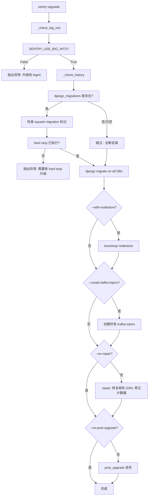

# 第十八章：自托管部署与运维

## 目录

- [18.1 自托管概述](#181-自托管概述)
  - [18.1.1 与 SaaS 版的区别](#1811-与-saas-版的区别)
  - [18.1.2 SENTRY_MODE 模式枚举](#1812-sentry_mode-模式枚举)
  - [18.1.3 适用场景分析](#1813-适用场景分析)
  - [18.1.4 硬件最低要求](#1814-硬件最低要求)
- [18.2 部署架构](#182-部署架构)
  - [18.2.1 Docker Compose 整体架构](#1821-docker-compose-整体架构)
  - [18.2.2 服务组件清单](#1822-服务组件清单)
  - [18.2.3 网络拓扑与通信关系](#1823-网络拓扑与通信关系)
- [18.3 安装步骤详解](#183-安装步骤详解)
  - [18.3.1 环境准备](#1831-环境准备)
  - [18.3.2 配置文件生成：sentry init](#1832-配置文件生成sentry-init)
  - [18.3.3 sentry.conf.py 逐行解析](#1833-sentryconfpy-逐行解析)
  - [18.3.4 config.yml 运行时选项配置](#1834-configyml-运行时选项配置)
  - [18.3.5 密钥生成与安全管理](#1835-密钥生成与安全管理)
  - [18.3.6 数据库初始化与迁移](#1836-数据库初始化与迁移)
- [18.4 核心服务配置](#184-核心服务配置)
  - [18.4.1 PostgreSQL](#1841-postgresql)
  - [18.4.2 Redis 集群配置](#1842-redis-集群配置)
  - [18.4.3 Kafka](#1843-kafka)
  - [18.4.4 ClickHouse 与 Snuba](#1844-clickhouse-与-snuba)
  - [18.4.5 Relay 自建部署](#1845-relay-自建部署)
  - [18.4.6 Symbolicator 符号化服务](#1846-symbolicator-符号化服务)
  - [18.4.7 TaskBroker 任务调度](#1847-taskbroker-任务调度)
- [18.5 反向代理与 SSL](#185-反向代理与-ssl)
  - [18.5.1 Nginx 配置模板](#1851-nginx-配置模板)
  - [18.5.2 Caddy 配置](#1852-caddy-配置)
  - [18.5.3 HTTPS 与代理头处理](#1853-https-与代理头处理)
  - [18.5.4 CDN 与静态资源](#1854-cdn-与静态资源)
- [18.6 邮件与通知配置](#186-邮件与通知配置)
  - [18.6.1 SMTP 配置详解](#1861-smtp-配置详解)
  - [18.6.2 Mailgun 入站邮件](#1862-mailgun-入站邮件)
  - [18.6.3 通知渠道配置](#1863-通知渠道配置)
- [18.7 备份与恢复](#187-备份与恢复)
  - [18.7.1 PostgreSQL 备份策略](#1871-postgresql-备份策略)
  - [18.7.2 ClickHouse 备份](#1872-clickhouse-备份)
  - [18.7.3 文件存储备份](#1873-文件存储备份)
  - [18.7.4 配置备份与 sentry backup export](#1874-配置备份与-sentry-backup-export)
  - [18.7.5 灾难恢复流程](#1875-灾难恢复流程)
- [18.8 升级与维护](#188-升级与维护)
  - [18.8.1 升级命令 sentry upgrade 深度解析](#1881-升级命令-sentry-upgrade-深度解析)
  - [18.8.2 Migration 执行机制](#1882-migration-执行机制)
  - [18.8.3 升级前后检查](#1883-升级前后检查)
  - [18.8.4 零停机升级策略](#1884-零停机升级策略)
  - [18.8.5 SELF_HOSTED_STABLE_VERSION 版本追踪](#1885-self_hosted_stable_version-版本追踪)
- [18.9 监控与日志](#189-监控与日志)
  - [18.9.1 LOGGING 配置深度解析](#1891-logging-配置深度解析)
  - [18.9.2 日志收集架构](#1892-日志收集架构)
  - [18.9.3 健康检查端点](#1893-健康检查端点)
  - [18.9.4 backpressure-monitor 背压监控](#1894-backpressure-monitor-背压监控)
  - [18.9.5 用 Sentry 监控 Sentry](#1895-用-sentry-监控-sentry)
- [18.10 多区域部署（Cell 模式）](#1810-多区域部署cell-模式)
  - [18.10.1 Silo 模式架构](#18101-silo-模式架构)
  - [18.10.2 Cell 的配置与注册](#18102-cell-的配置与注册)
  - [18.10.3 跨区域 RPC 通信](#18103-跨区域-rpc-通信)
  - [18.10.4 自托管场景的简化方案](#18104-自托管场景的简化方案)
- [18.11 安全加固](#1811-安全加固)
  - [18.11.1 防火墙与网络隔离](#18111-防火墙与网络隔离)
  - [18.11.2 密钥管理体系](#18112-密钥管理体系)
  - [18.11.3 数据库加密字段](#18113-数据库加密字段)
  - [18.11.4 内部 IP 与允许列表](#18114-内部-ip-与允许列表)
- [18.12 常见运维问题排查](#1812-常见运维问题排查)

---

## 18.1 自托管概述

### 18.1.1 与 SaaS 版的区别

Sentry 提供两种使用方式：官方的 SaaS 服务（sentry.io）和自托管（self-hosted）部署。两者共享同一套代码库，差异仅在于部署模式和运行规模。

SaaS 版由 Sentry 团队运维，采用多区域 Cell 架构，控制平面（Control Silo）与数据平面（Region Silo）分离，底层使用 Kubernetes 编排，具备全球多区域容灾和弹性伸缩能力。

自托管版面向数据隐私敏感、需要在内部网络运行的场景。所有数据存储在自有基础设施上，不经过 Sentry 官方服务器。关键差异如下：

| 维度 | SaaS (sentry.io) | Self-Hosted |
|------|-----------------|-------------|
| **SENTRY_MODE** | `SAAS` | `SELF_HOSTED` |
| **多租户** | 支持海量组织 | `SENTRY_SINGLE_ORGANIZATION=True`（默认） |
| **多区域** | 全球 Cell 部署 | 单区域 Monolith |
| **Beacon** | 默认开启 | 可关闭（`SENTRY_BEACON=False`） |
| **功能特性** | 全部功能 | errors-only 模式可选 |
| **外部连接** | 正常联网 | `SENTRY_AIR_GAP=True` 支持离线运行 |

### 18.1.2 SENTRY_MODE 模式枚举

Sentry 通过 `SENTRY_MODE` 配置项区分运行模式，定义在 `src/sentry/conf/types/sentry_config.py`：

```python
SentryMode = StrEnum("SentryMode", ("SELF_HOSTED", "SINGLE_TENANT", "SAAS"))
```

在 `server.py` 中，自托管部署默认以 `SELF_HOSTED` 模式启动：

```python
SENTRY_MODE = SentryMode.SELF_HOSTED

# 兼容旧代码，实际逻辑统一走 SENTRY_MODE
SENTRY_SELF_HOSTED = SENTRY_MODE == SentryMode.SELF_HOSTED
```

三种模式的分层关系：`SELF_HOSTED` 是基础层——社区用户在自己的服务器上运行完整单体；`SINGLE_TENANT` 在此基础上叠加了商业版的单租户功能；`SAAS` 是 sentry.io 的完整多租户集群。你可以把 `SELF_HOSTED` 理解为 "Sentry Monolith"，所有组件在一个进程/一组容器中运行，通过 Django 的 routing 层访问同一套数据库。

`SENTRY_SELF_HOSTED_ERRORS_ONLY` 是一个额外的精简开关：设为 `True` 时禁用 Performance、Profiling、Replays 等模块，只保留错误监控核心功能，大幅降低资源消耗。

### 18.1.3 适用场景分析

自托管部署适合以下场景：

1. **数据合规要求**：金融、医疗、政府等行业要求数据不离开内部网络。配置 `SENTRY_AIR_GAP = True` 可彻底禁用向外部发送任何数据（包括 Beacon、Release Registry、SDK 版本检查等）。
2. **高事件量私有部署**：日均百万级以上事件的私有化部署，需要独立调配计算资源。
3. **定制化需求**：需要修改 Sentry 源码、添加自定义插件或集成内部系统。
4. **开发与测试环境**：为团队搭建隔离的预发布 Sentry 环境，避免污染生产数据。

不适合的场景：团队规模小、无专职运维人员、事件量低。此时 SaaS 版的免费额度（每月 5000 错误事件）已经足够。

### 18.1.4 硬件最低要求

基于官方 Docker Compose 部署方案，最低推荐配置：

| 资源 | 最低要求 | 推荐配置 |
|------|---------|---------|
| **CPU** | 4 核 | 8 核以上 |
| **内存** | 8 GB | 16 GB+ |
| **磁盘** | 50 GB SSD | 200 GB+ NVMe SSD |
| **操作系统** | Linux (x86_64) | Ubuntu 22.04+ / Debian 12+ |

关键内存消耗分析（基于 `server.py` 中的默认配置）：

- **PostgreSQL**：共享缓冲区和连接池约 1-2 GB
- **Redis**：按 `redis.clusters.default` 配置，所有子系统共享同一 Redis 实例：Buffers、Quotas、TSDB、Digests、Rate Limiter、Relay ProjectConfig Cache、Span Buffer、TaskWorker 状态存储等共计 20+ 子系统的 key 空间，推荐 2-4 GB
- **Kafka**：默认 broker 分配 1-2 GB 堆内存
- **ClickHouse**：按 `SENTRY_DISTRIBUTED_CLICKHOUSE_TABLES = False` 的单机模式，至少 2 GB 内存用于查询缓存和合并操作
- **Sentry Web + Worker**：每个 uWSGI/granian worker 约 200-500 MB，默认多 worker 模式
- **Snuba**：作为 ClickHouse 查询代理，实际内存消耗取决于查询并发量
- **Relay**：默认单实例处理事件过滤和速率限制，约 500 MB
- **Symbolicator**：符号化 native crash 报告，按需内存较大

磁盘 I/O 是自托管性能的核心瓶颈——ClickHouse 的 MergeTree 写入和 Kafka 的日志段刷盘都需要低延迟磁盘。

---

## 18.2 部署架构

### 18.2.1 Docker Compose 整体架构

Sentry 官方提供的 `self-hosted` 部署方案基于 Docker Compose V2。Dockerfile 位于 `self-hosted/Dockerfile`，基于 `python:3.13.1-slim-bookworm` 构建：

```dockerfile
FROM python:3.13.1-slim-bookworm

RUN groupadd -r sentry --gid 999 && useradd -r -m -g sentry --uid 999 sentry

# 安装运行时依赖
RUN apt-get update && DEBIAN_FRONTEND=noninteractive apt-get install -y \
    gosu libexpat1 tini

# 安装 uv 管理 Python 依赖
RUN python3 -m pip install 'uv==0.9.28'
RUN python3 -m venv /.venv

ENV SENTRY_CONF=/etc/sentry
ENV GRPC_POLL_STRATEGY=epoll1

# 编译安装源码
COPY . .
RUN python3 -m tools.fast_editable --path .
RUN python3 -m compileall -q src/

# 复制自托管配置
COPY ./self-hosted/sentry.conf.py ./self-hosted/config.yml $SENTRY_CONF/
COPY ./self-hosted/docker-entrypoint.sh /

EXPOSE 9000
VOLUME /data
ENTRYPOINT ["/docker-entrypoint.sh"]
CMD ["run", "web"]
```

入口脚本 `docker-entrypoint.sh` 展示了容器的启动逻辑：

```bash
#!/bin/bash
set -e

if [ "${1:0:1}" = '-' ]; then
    set -- sentry "$@"
fi

if [[ $1 =~ ^[[:alnum:]]+$ ]] && grep -Fxq "$1" /sentry-commands.txt; then
    set -- sentry "$@";
fi

if [ "$1" = 'sentry' ]; then
    set -- tini -- "$@"
    if [ "$(id -u)" = '0' ]; then
        mkdir -p /data/files
        sentry_uid=$(id -u sentry)
        if [ "$(stat -c %u /data)" != "$sentry_uid" ] || \
           [ "$(stat -c %u /data/files)" != "$sentry_uid" ]; then
            find /data ! -user sentry -exec chown sentry {} \;
        fi
        set -- gosu sentry "$@"
    fi
fi

exec "$@"
```

关键在于：以 root 启动后自动修正 `/data` 目录归属，然后通过 `gosu` 切换到非特权 `sentry` 用户（uid=999）运行。`tini` 作为 PID 1 负责信号转发和僵尸进程回收。

### 18.2.2 服务组件清单

自托管完整部署包含以下 Docker 服务：

| 服务 | 镜像/来源 | 端口 | 用途 |
|------|----------|------|------|
| **sentry-web** | 自构建 Dockerfile | 9000 | Django web 服务（含前端静态文件） |
| **sentry-worker** | 同上 | - | 后台任务处理（Celery/TaskBroker 消费） |
| **sentry-cron** | 同上 | - | 定时任务调度（Celery Beat） |
| **postgres** | postgres:16 | 5432 | 主数据库（metadata、配置） |
| **redis** | redis:7 | 6379 | 缓存、缓冲、配额、状态存储 |
| **kafka** | confluentinc/cp-kafka | 9092 | 消息队列（事件、指标、监控） |
| **zookeeper** | confluentinc/cp-zookeeper | 2181 | Kafka 集群协调（KRaft 模式可移除） |
| **clickhouse** | clickhouse/clickhouse-server | 8123/9000 | 时序数据仓库 |
| **snuba-api** | getsentry/snuba | 1218 | ClickHouse 查询 API 代理 |
| **snuba-consumer** | getsentry/snuba | - | Kafka 消费写入 ClickHouse |
| **snuba-replacer** | getsentry/snuba | - | ClickHouse 数据合并/替换 |
| **relay** | getsentry/relay | 7899/3000 | 事件网关（过滤、限流、规范化） |
| **symbolicator** | getsentry/symbolicator | 3021 | Native crash 符号化 |
| **nginx** | nginx:alpine | 80/443 | 反向代理 + SSL 终端 |

### 18.2.3 网络拓扑与通信关系

以下是从代码中提取的各组件之间的通信关系：

```
                     Internet
                        |
                  +-----v-----+
                  |   Nginx   |  :80/:443
                  +-----+-----+
                        |
                  +-----v-----+
                  | Sentry Web|  :9000  (Django + granian/uWSGI)
                  +-----+-----+
                        |
          +-------------+-------------+-------------+
          |             |             |             |
    +-----v----+  +----v-----+  +---v----+  +----v------+
    |PostgreSQL|  |  Redis   |  | Snuba  |  | TaskBroker |
    |   :5432  |  |  :6379   |  | :1218  |  | (gRPC)    |
    +----------+  +----------+  +---+----+  +-----------+
                                    |
                              +-----v------+
                              | ClickHouse  |
                              | :8123/:9000 |
                              +-------------+

    事件摄入路径:
    SDK --> Relay(:7899) --> Kafka(:9092) --> Snuba Consumer --> ClickHouse
                    |              |
                    +--> Sentry Web(:9000) --> PostgreSQL/Redis
```

Relay 对外暴露 7899 端口接收 SDK 上报的事件。这个端口在生产中通常不直接暴露给公网——SDK 通过 Nginx 反向代理到 Relay。Relay 处理完过滤/规范化之后，将事件同时写入 Kafka 和通过 HTTP 推送到 Sentry Web。

---

## 18.3 安装步骤详解

### 18.3.1 环境准备

**操作系统**：推荐 Ubuntu 22.04 LTS 或 Debian 12。需要 x86_64 架构（部分组件如 Symbolicator 在 ARM 上可用性受限）。

**基础软件**：
- Docker CE 26+ 和 Docker Compose V2
- Git（克隆仓库）
- curl/wget（下载依赖）

**系统参数调优**：

```bash
# 增加虚拟内存区域数量（Elasticsearch/ClickHouse 需要）
echo "vm.max_map_count=262144" >> /etc/sysctl.conf
sysctl -p

# 增加文件描述符限制
echo "* soft nofile 65536" >> /etc/security/limits.conf
echo "* hard nofile 65536" >> /etc/security/limits.conf
```

**克隆仓库**：

```bash
git clone https://github.com/getsentry/self-hosted.git
cd self-hosted
```

### 18.3.2 配置文件生成：sentry init

`src/sentry/runner/commands/init.py` 实现了 `sentry init` 命令，用于生成初始配置目录和文件：

```python
def _generate_settings(dev: bool = False) -> tuple[str, str]:
    context = {
        "secret_key": generate_secret_key(),
        "debug_flag": dev,
        "mail.backend": "console" if dev else "smtp",
    }

    py = _load_config_template(DEFAULT_SETTINGS_OVERRIDE, "default") % context
    yaml = _load_config_template(DEFAULT_SETTINGS_CONF, "default") % context
    return py, yaml
```

Docker 镜像构建时已将 `self-hosted/sentry.conf.py` 和 `self-hosted/config.yml` 复制到 `/etc/sentry/`。首次安装时运行：

```bash
# 生成 .env 配置文件（含生成的密钥）
./install.sh
```

`install.sh` 内部会执行 `sentry config generate-secret-key` 生成安全的随机密钥。

### 18.3.3 sentry.conf.py 逐行解析

`self-hosted/sentry.conf.py` 是自托管部署最重要的配置文件。它是完整的 Python 模块（带 Django 上下文），从 `sentry.conf.server` 导入所有默认配置后进行覆盖。以下是关键配置段的分析：

**数据库连接**：

```python
postgres = env("SENTRY_POSTGRES_HOST") or \
           (env("POSTGRES_PORT_5432_TCP_ADDR") and "postgres")
if postgres:
    DATABASES = {
        "default": {
            "ENGINE": "sentry.db.postgres",
            "NAME": (env("SENTRY_DB_NAME") or "postgres"),
            "USER": (env("SENTRY_DB_USER") or "postgres"),
            "PASSWORD": (env("SENTRY_DB_PASSWORD") or ""),
            "HOST": postgres,
            "PORT": (env("SENTRY_POSTGRES_PORT") or ""),
        }
    }
```

数据库连接有两种配置方式：Docker Compose 的 link 机制自动注入 `POSTGRES_PORT_5432_TCP_ADDR` 环境变量；或者显式设置 `SENTRY_POSTGRES_HOST`。自托管部署优先使用环境变量，因为所有服务在同一个 Docker 网络中。

**单组织模式**：

```python
SENTRY_SINGLE_ORGANIZATION = Bool(env("SENTRY_SINGLE_ORGANIZATION", True))
```

设为 `True` 时，Sentry UI 会隐藏多组织切换界面，注册新用户时自动加入到唯一组织。这在自托管场景很实用——大多数私有部署只需要一个组织。

**Redis 集群**：

```python
SENTRY_OPTIONS.update({
    "redis.clusters": {
        "default": {
            "hosts": {
                0: {
                    "host": redis,
                    "password": redis_password,
                    "port": redis_port,
                    "db": redis_db,
                }
            }
        }
    }
})
```

所有子系统共用一个 `default` 集群（单节点 Redis）。注意 `server.py` 中 `SENTRY_DYNAMIC_SAMPLING_RULES_REDIS_CLUSTER` 等 20+ 个配置项都指向 `"default"`，这意味着在单 Redis 实例的场景下，所有 key 空间混在一起——需要通过 db 号（`SENTRY_REDIS_DB`）做逻辑隔离。

**各子系统后端配置**：

```python
SENTRY_CACHE = "sentry.cache.redis.RedisCache"
SENTRY_RATELIMITER = "sentry.ratelimits.redis.RedisRateLimiter"
SENTRY_BUFFER = "sentry.buffer.redis.RedisBuffer"
SENTRY_QUOTAS = "sentry.quotas.redis.RedisQuota"
SENTRY_TSDB = "sentry.tsdb.redissnuba.RedisSnubaTSDB"
SENTRY_DIGESTS = "sentry.digests.backends.redis.RedisBackend"
```

每个 `SENTRY_*` 变量指定了对应的后端实现类。自托管通过 Redis 承载所有核心功能：缓存（Cache）、速率限制（RateLimiter）、写入缓冲（Buffer）、配额管理（Quotas）、时序数据存储（TSDB）、通知摘要（Digests）以及 Relay 项目配置缓存。

**Web 服务器与 SSL 代理**：

```python
SENTRY_WEB_HOST = "0.0.0.0"
SENTRY_WEB_PORT = 9000
SENTRY_WEB_OPTIONS = {
    # 'workers': 1,  # the number of web workers
}

# 如果使用反向 SSL 代理，取消注释以下设置：
# SECURE_PROXY_SSL_HEADER = ('HTTP_X_FORWARDED_PROTO', 'https')
# SESSION_COOKIE_SECURE = True
# CSRF_COOKIE_SECURE = True
```

Web 服务绑定到所有网络接口的 9000 端口。`SECURE_PROXY_SSL_HEADER` 配置告知 Django 信任 Nginx/Caddy 传递的 `X-Forwarded-Proto` 头。

**Relay**：

```python
SENTRY_USE_RELAY = True
```

自托管默认开启 Relay。Relay 在内部网络中运行，SDK 直接或通过 Nginx 反向代理将事件发送到 Relay 的 7899 端口。

### 18.3.4 config.yml 运行时选项配置

`self-hosted/config.yml` 是 YAML 格式的运行时选项配置文件，与 `sentry.conf.py` 互补。`sentry.conf.py` 中定义 Python 级别的配置（数据库连接、后端选择等），`config.yml` 中定义可通过 `sentry config set` 命令行或管理 UI 动态修改的运行时选项：

```yaml
filestore.backend: 'filesystem'
filestore.options:
  location: '/data/files'
dsym.cache-path: '/data/dsym-cache'
releasefile.cache-path: '/data/releasefile-cache'
```

文件存储默认使用本地文件系统，路径为 `/data/files`。这个路径对应 Dockerfile 中的 `VOLUME /data`，需要在 docker-compose 中挂载到宿主机目录以确保数据持久化。生产环境建议改为 S3 兼容对象存储：

```yaml
filestore.backend: 's3'
filestore.options:
  access_key: 'AKIXXXXXX'
  secret_key: 'XXXXXXX'
  bucket_name: 's3-bucket-name'
```

配置文件发现机制由 `sentry runner settings` 模块实现，`config discover` 子命令可以打印当前加载的配置文件路径：

```bash
sentry config discover
# 输出 /etc/sentry/sentry.conf.py
# 输出 /etc/sentry/config.yml
```

### 18.3.5 密钥生成与安全管理

密钥生成在 `src/sentry/runner/commands/init.py` 中实现：

```python
def generate_secret_key() -> str:
    chars = "abcdefghijklmnopqrstuvwxyz0123456789!@#%^&*(-_=+)"
    return get_random_string(50, chars)
```

`get_random_string` 使用 Django 的 `secrets.SystemRandom` 作为随机源，基于操作系统提供的 CSPRNG（在 Linux 上是 `/dev/urandom`）。生成的密钥长度为 50 字符，字符集包含大小写字母、数字和特殊符号。

在 `sentry.conf.py` 中，对密钥的安全性有明确提示：

```python
secret_key = env("SENTRY_SECRET_KEY")
if not secret_key:
    raise Exception(
        "Error: SENTRY_SECRET_KEY is undefined, "
        "run `generate-secret-key` and set to -e SENTRY_SECRET_KEY"
    )

if "SENTRY_RUNNING_GRANIAN" not in os.environ and len(secret_key) < 32:
    print("!!                    CAUTION                       !!")
    print("!! Your SENTRY_SECRET_KEY is potentially insecure.  !!")
    print("!!    We recommend at least 32 characters long.     !!")
    print("!!     Regenerate with `generate-secret-key`.       !!")

SENTRY_OPTIONS["system.secret-key"] = secret_key
```

密钥的应用场景：
- Django 的 `SECRET_KEY`：CSRF token、session 签名、密码重置 token
- `system.secret-key`：内部 API 调用的 HMAC 签名
- 密钥泄露的后果：所有已登录 session 作废、可伪造任意内部请求

**密钥轮换建议**：
1. 生成新密钥：`docker compose run --rm web sentry config generate-secret-key`
2. 更新 `.env` 中 `SENTRY_SECRET_KEY` 的值
3. 重启所有 Sentry 服务
4. 注意：轮换密钥会使所有现有用户 session 失效，用户需要重新登录

### 18.3.6 数据库初始化与迁移

首次安装时的数据库初始化流程由 `install.sh` 编排，核心是 `sentry upgrade` 命令（详见 18.8 节）。简化步骤：

```bash
# 1. 生成 Django migrations
docker compose run --rm web sentry upgrade --noinput

# 2. 创建超级用户（交互式）
docker compose run --rm web sentry createuser \
    --email admin@example.com \
    --password <password> \
    --superuser

# 3. 启动所有服务
docker compose up -d
```

`upgrade` 命令内部执行：
1. `_check_big_ints()`：检查是否仍配置了 `SENTRY_USE_BIG_INTS = False`（已废弃，现在强制使用 bigint 主键）
2. `_check_history()`：检查是否跳过了关键的 squash migration（hard stop）
3. 对所有非只读数据库连接执行 `django migrate`
4. 执行 `repair`：修复缺失的 DSN、修正 Group 计数器
5. 发送 `post_upgrade` 信号，触发各模块的初始化逻辑

---

## 18.4 核心服务配置

### 18.4.1 PostgreSQL

Sentry 使用 PostgreSQL 作为主数据库，存储所有元数据：用户、组织、项目、事件分组（Groups）、规则、集成配置等。

**最小配置**（`postgresql.conf`）：

```ini
max_connections = 200
shared_buffers = 512MB
effective_cache_size = 1536MB
maintenance_work_mem = 128MB
checkpoint_completion_target = 0.9
wal_buffers = 16MB
default_statistics_target = 100
random_page_cost = 1.1
effective_io_concurrency = 200
work_mem = 5242kB
min_wal_size = 1GB
max_wal_size = 4GB
max_worker_processes = 8
max_parallel_workers_per_gather = 4
max_parallel_workers = 8
max_parallel_maintenance_workers = 4
```

**Django 数据库配置解读**（`server.py`）：

```python
DATABASES = {
    "default": {
        "ENGINE": "sentry.db.postgres",
        "AUTOCOMMIT": True,
        "ATOMIC_REQUESTS": False,
    }
}
```

- `sentry.db.postgres` 是 Sentry 定制的 PostgreSQL 后端，提供额外的连接管理和查询优化
- `AUTOCOMMIT = True`：每个 SQL 语句自动提交，Django 的事务管理只在显式 `transaction.atomic()` 上下文中生效
- `ATOMIC_REQUESTS = False`：每个 HTTP 请求不在事务中包裹，避免长时间请求持有数据库连接和锁

**连接池**：Sentry 不使用 PgBouncer 等外部连接池，而是依赖 Django 的 `CONN_MAX_AGE` 参数维持持久连接。可以通过 `DATABASE_URL` 环境变量简化连接字符串配置：

```python
if "DATABASE_URL" in os.environ:
    url = urlparse(os.environ["DATABASE_URL"])
    DATABASES["default"].update({
        "NAME": url.path[1:],
        "USER": url.username,
        "PASSWORD": url.password,
        "HOST": url.hostname,
        "PORT": url.port,
    })
```

### 18.4.2 Redis 集群配置

Redis 在 Sentry 中扮演的角色远超简单的 key-value 缓存。分析 `server.py` 中的配置，至少有 22 个独立子系统依赖 Redis：

```
SENTRY_DYNAMIC_SAMPLING_RULES_REDIS_CLUSTER = "default"
SENTRY_INCIDENT_RULES_REDIS_CLUSTER = "default"
SENTRY_RATE_LIMIT_REDIS_CLUSTER = "default"
SENTRY_RULE_TASK_REDIS_CLUSTER = "default"
SENTRY_TRANSACTION_NAMES_REDIS_CLUSTER = "default"
SENTRY_WEBHOOK_LOG_REDIS_CLUSTER = "default"
SENTRY_ARTIFACT_BUNDLES_INDEXING_REDIS_CLUSTER = "default"
SENTRY_DEBUG_FILES_REDIS_CLUSTER = "default"
SENTRY_MONITORS_REDIS_CLUSTER = "default"
SENTRY_STATISTICAL_DETECTORS_REDIS_CLUSTER = "default"
SENTRY_METRIC_META_REDIS_CLUSTER = "default"
SENTRY_ESCALATION_THRESHOLDS_REDIS_CLUSTER = "default"
SENTRY_SPAN_BUFFER_CLUSTER = "default"
SENTRY_ASSEMBLE_CLUSTER = "default"
SENTRY_UPTIME_DETECTOR_CLUSTER = "default"
SENTRY_WORKFLOW_ENGINE_REDIS_CLUSTER = "default"
SENTRY_HYBRIDCLOUD_BACKFILL_OUTBOXES_REDIS_CLUSTER = "default"
SENTRY_WEEKLY_REPORTS_REDIS_CLUSTER = "default"
SENTRY_HYBRIDCLOUD_DELETIONS_REDIS_CLUSTER = "default"
SENTRY_SESSION_STORE_REDIS_CLUSTER = "default"
SENTRY_AUTH_IDPMIGRATION_REDIS_CLUSTER = "default"
SENTRY_SNOWFLAKE_REDIS_CLUSTER = "default"
SENTRY_SCM_REDIS_CLUSTER = "default"
SENTRY_SERVICE_MONITORING_REDIS_CLUSTER = "default"
```

在自托管部署中，所有这些子系统都指向同一个 `"default"` 集群——一个单节点 Redis 实例。当事件量增长时，Redis 的 CPU 和内存会首先成为瓶颈。

**生产优化建议**：
1. 为不同子系统分配独立的 Redis DB 号（`db: 0` 到 `db: 15`）
2. 配置 Redis 最大内存和淘汰策略：`maxmemory 4gb maxmemory-policy allkeys-lru`
3. 对于超过 10 万事件/天的部署，将处理负载最高的子系统（TSDB、Buffers、Quotas）分离到独立 Redis 实例

**Memcached 补充缓存**：

```python
memcached = env("SENTRY_MEMCACHED_HOST") or \
            (env("MEMCACHED_PORT_11211_TCP_ADDR") and "memcached")
if memcached:
    CACHES = {
        "default": {
            "BACKEND": "sentry.cache.backends.reconnectingmemcache.ReconnectingMemcache",
            "LOCATION": [memcached + ":" + memcached_port],
            "TIMEOUT": 3600,
            "OPTIONS": {"ignore_exc": True, "reconnect_age": 300},
        }
    }
```

Memcached 作为 Django 的 `CACHES` 后端是可选的。当配置了 Memcached 时，Django 的模板缓存、数据库查询缓存等走 Memcached 高速缓存；而核心业务缓存（事件处理、缓冲等）仍然走 Redis 的 `SENTRY_CACHE`。

### 18.4.3 Kafka

Kafka 是 Sentry 事件管道的核心消息队列。配置定义在 `server.py` 中：

```python
KAFKA_CLUSTERS: dict[str, dict[str, Any]] = {
    "default": {
        "common": {"bootstrap.servers": "127.0.0.1:9092"},
        "producers": {
            "compression.type": "lz4",
            "message.max.bytes": 50000000,  # 50MB
        },
        "consumers": {},
    }
}
```

关键生产者参数：
- `compression.type: lz4`：使用 LZ4 压缩算法，压缩比适中但速度极快，适合事件流的高吞吐场景
- `message.max.bytes: 50000000`（50 MB）：允许单条消息最大 50 MB。这对包含大型 source map 或 minidump 的事件至关重要

**Topic 映射**：`KAFKA_TOPIC_TO_CLUSTER` 字典定义了 50+ 个 topic 到集群的映射关系：

```python
KAFKA_TOPIC_TO_CLUSTER: Mapping[str, str] = {
    "events": "default",
    "ingest-events": "default",
    "transactions": "default",
    "ingest-metrics": "default",
    "profiles": "default",
    "taskworker": "default",
    # ... 共 50+ 个 topic
}
```

自托管环境下，所有 topic 指向同一个 `default` 集群。Kafka broker 至少需要以下 topic 配置：

```properties
num.partitions=8
default.replication.factor=1
log.retention.hours=168
log.segment.bytes=1073741824
```

对于自托管单节点 Kafka，`replication.factor=1` 是唯一可行的配置（无冗余副本），这意味着 broker 宕机会丢失未消费的消息。

**Kafka topic 覆盖**：通过 `KAFKA_TOPIC_OVERRIDES` 可以将默认 topic 映射到自定义名称：

```python
KAFKA_TOPIC_OVERRIDES: Mapping[str, str] = {}
```

这在需要前缀或后缀（如多环境隔离）时非常有用。

### 18.4.4 ClickHouse 与 Snuba

ClickHouse 存储所有时序事件数据：错误事件、性能事务、Replay 回放、Profile 分析等。Snuba 作为 ClickHouse 之上的查询层，提供统一的查询 API。

**Sentry 中的 Snuba 配置**：

```python
SENTRY_SNUBA = os.environ.get("SNUBA", "http://127.0.0.1:1218")
SENTRY_SNUBA_TIMEOUT = 30
SENTRY_SNUBA_CACHE_TTL_SECONDS = 60
```

- `SENTRY_SNUBA`：Snuba 查询 API 地址，默认 `http://127.0.0.1:1218`
- `SENTRY_SNUBA_TIMEOUT`：查询超时时间（30 秒）。复杂聚合查询可能耗时较长
- `SENTRY_SNUBA_CACHE_TTL_SECONDS`：查询结果缓存 TTL（60 秒）。在 Dashboard 刷新和 Discover 查询场景中减少重复查询

**分布式 ClickHouse 表**：

```python
SENTRY_DISTRIBUTED_CLICKHOUSE_TABLES = False
```

自托管默认为单节点模式。当设置为 `True` 时，Snuba 创建的将是 `Distributed` 引擎表，通过 `_all` 后缀的本地表前缀路由到 ClickHouse 集群的多个分片。

**ClickHouse 核心配置**（`config.xml` 关键项）：

```xml
<max_connections>4096</max_connections>
<max_concurrent_queries>100</max_concurrent_queries>
<max_memory_usage>10000000000</max_memory_usage>
<max_bytes_before_external_group_by>50000000000</max_bytes_before_external_group_by>
```

- `max_memory_usage`（10 GB）：单查询最大内存使用量。超过后查询被终止
- `max_bytes_before_external_group_by`（50 GB）：允许 GROUP BY 溢出到磁盘的阈值。Disable 则为 0

**存储策略**：ClickHouse 的 MergeTree 引擎支持多卷存储策略，可以将热数据放在 SSD、冷数据迁移到 HDD：

```xml
<storage_configuration>
    <disks>
        <default><path>/var/lib/clickhouse/</path></default>
        <cold><path>/mnt/cold/clickhouse/</path></cold>
    </disks>
    <policies>
        <hot_to_cold>
            <volumes>
                <hot><disk>default</disk><max_data_part_size_bytes>10000000000</max_data_part_size_bytes></hot>
                <cold><disk>cold</disk></cold>
            </volumes>
            <move_factor>0.2</move_factor>
        </hot_to_cold>
    </policies>
</storage_configuration>
```

### 18.4.5 Relay 自建部署

Relay 是 Sentry 的事件网关，在 `server.py` 中的核心配置：

```python
SENTRY_USE_RELAY = False        # 开发环境默认关闭
SENTRY_RELAY_PORT = 7899
SENTRY_RELAY_OPEN_REGISTRATION = True
SENTRY_RELAY_STATIC_AUTH: dict[str, Any] = {}
```

自托管部署在 `sentry.conf.py` 中将 `SENTRY_USE_RELAY` 设为 `True`：

```python
SENTRY_USE_RELAY = True
```

**Relay 注册机制**：

- `SENTRY_RELAY_OPEN_REGISTRATION = True`：允许任意 Relay 实例向 Sentry 注册（仅适合内网环境）
- `SENTRY_RELAY_STATIC_AUTH = {}`：静态认证的公钥列表，可以在此预先注册已知的 Relay 公钥，关闭开放注册后使用
- `SENTRY_RELAY_WHITELIST_PK`：已批准的公钥白名单

**Relay 的 projectconfig 缓存**：

```python
SENTRY_RELAY_PROJECTCONFIG_CACHE = \
    "sentry.relay.projectconfig_cache.redis.RedisProjectConfigCache"

SENTRY_RELAY_PROJECTCONFIG_DEBOUNCE_CACHE = \
    "sentry.relay.projectconfig_debounce_cache.base.ProjectConfigDebounceCache"
```

Relay 在处理每个事件前需要查询对应项目的配置（采样率、过滤器、PII 规则等）。`RedisProjectConfigCache` 将配置缓存在 Redis 中，避免每次事件都查询 PostgreSQL。`ProjectConfigDebounceCache` 防止短时间内同一项目的频繁配置更新。

**Relay 内部采样**：

```python
SENTRY_RELAY_TASK_APM_SAMPLING = 1 if DEBUG else 0
```

Relay 自身会产生 internal processing 事件。此配置控制这些内部事件的采样率。

### 18.4.6 Symbolicator 符号化服务

Symbolicator 负责将 Native SDK 上报的原始内存地址和偏移量符号化为可读的函数名、文件名和行号。配置由 Snuba 和 Sentry 共同管理：

```python
SYMBOLICATOR_PROCESS_EVENT_HARD_TIMEOUT = 15 * 60  # 15 分钟
SYMBOLICATOR_PROCESS_EVENT_WARN_TIMEOUT = 2 * 60   # 2 分钟
SYMBOLICATOR_POLL_TIMEOUT = 5  # 5 秒
```

- `HARD_TIMEOUT`：单个事件的符号化处理最长允许 15 分钟。超时后事件被标记为处理失败，不会丢失
- `WARN_TIMEOUT`：超过 2 分钟记录 WARNING 日志，用于提前发现问题（如 Symbolicator 过载、debug 文件过大）
- `POLL_TIMEOUT`：Sentry 轮询 Symbolicator 状态的间隔为 5 秒

对于自托管部署，Symbolicator 需要挂载 debug 文件目录或配置 S3 bucket 作为符号文件源。

### 18.4.7 TaskBroker 任务调度

Sentry 正在从 Celery 迁移到自研的 TaskBroker（基于 gRPC + Kafka）。`run.py` 中的 `taskworker` 命令展示了新模式：

```python
@run.command()
def taskworker(**options: Any) -> None:
    "Run a taskworker worker"
    os.environ["GRPC_ENABLE_FORK_SUPPORT"] = "0"
    run_taskworker(**options)
```

TaskBroker 支持两种工作模式：
- **PULL 模式**（默认）：worker 主动从 broker 拉取任务
- **PUSH 模式**（`--push-mode`）：broker 主动推送任务到 worker 的 gRPC 端口

TaskWorker 配置：

```python
TASKWORKER_ALWAYS_EAGER = False         # 立即执行（仅测试用）
TASKWORKER_SHARED_SECRET = os.getenv("TASKWORKER_SHARED_SECRET")
TASKWORKER_ROUTER = "sentry.taskworker.adapters.SentryRouter"
TASKWORKER_ROUTES = os.getenv("TASKWORKER_ROUTES")  # JSON 格式的 namespace:topic 映射
TASKWORKER_DEFAULT_TOPIC = os.getenv("TASKWORKER_DEFAULT_TOPIC")
```

`TASKWORKER_IMPORTS`（在 `server.py` 第 876 行起）定义了 60+ 个任务模块，涵盖了从通知发送到数据删除的所有后台任务。

---

## 18.5 反向代理与 SSL

### 18.5.1 Nginx 配置模板

Sentry Web 服务在 9000 端口监听，Relay 在 7899 端口监听。生产环境必须通过 Nginx 反向代理提供统一的 HTTPS 入口。以下是根据 `server.py` 的 SSL 配置生成的 Nginx 模板：

```nginx
upstream sentry_web {
    server sentry-web:9000;
}

upstream sentry_relay {
    server relay:7899;
}

server {
    listen 80;
    server_name sentry.example.com;
    return 301 https://$host$request_uri;
}

server {
    listen 443 ssl http2;
    server_name sentry.example.com;

    ssl_certificate     /etc/nginx/ssl/sentry.example.com.crt;
    ssl_certificate_key /etc/nginx/ssl/sentry.example.com.key;

    # 现代 SSL 配置
    ssl_protocols TLSv1.2 TLSv1.3;
    ssl_ciphers 'ECDHE-ECDSA-AES128-GCM-SHA256:ECDHE-RSA-AES128-GCM-SHA256';
    ssl_prefer_server_ciphers off;

    # 传递真实客户端 IP
    proxy_set_header Host $host;
    proxy_set_header X-Real-IP $remote_addr;
    proxy_set_header X-Forwarded-For $proxy_add_x_forwarded_for;
    proxy_set_header X-Forwarded-Proto $scheme;

    # 请求体大小限制（source map 上传可达 100MB+）
    client_max_body_size 100m;

    # 通用 API 路由到 Web
    location / {
        proxy_pass http://sentry_web;
        proxy_read_timeout 120s;
        proxy_buffering off;
    }

    # Relay 事件上报端点
    location /api/0/relays/ {
        proxy_pass http://sentry_web;
    }

    # SDK 事件上报（转到 Relay）
    location ~ ^/api/(\d+/)?(store|envelope|minidump|security|unreal)/ {
        proxy_pass http://sentry_relay;
        proxy_read_timeout 60s;
    }
}
```

### 18.5.2 Caddy 配置

Caddy 的自动 HTTPS 让配置更加简洁：

```caddyfile
sentry.example.com {
    reverse_proxy /api/*/store* sentry-relay:7899
    reverse_proxy /api/*/envelope* sentry-relay:7899
    reverse_proxy /api/*/minidump* sentry-relay:7899
    reverse_proxy /api/*/security* sentry-relay:7899
    reverse_proxy /api/*/unreal* sentry-relay:7899
    reverse_proxy sentry-web:9000

    header {
        X-Frame-Options "DENY"
        X-Content-Type-Options "nosniff"
        Referrer-Policy "strict-origin-when-cross-origin"
    }
}
```

### 18.5.3 HTTPS 与代理头处理

`server.py` 和 `sentry.conf.py` 中的代理头设置：

```python
# server.py 默认配置
SENTRY_USE_X_FORWARDED_FOR = True
SECURE_PROXY_SSL_HEADER = ('HTTP_X_FORWARDED_PROTO', 'https')

# sentry.conf.py 中提示的 SSL 安全设置
# SECURE_PROXY_SSL_HEADER = ('HTTP_X_FORWARDED_PROTO', 'https')
# SESSION_COOKIE_SECURE = True
# CSRF_COOKIE_SECURE = True
```

完整的生产环境 SSL 配置应在 `sentry.conf.py` 中启用：

```python
SECURE_PROXY_SSL_HEADER = ('HTTP_X_FORWARDED_PROTO', 'https')
SESSION_COOKIE_SECURE = True
CSRF_COOKIE_SECURE = True
SECURE_HSTS_SECONDS = 31536000
SECURE_HSTS_INCLUDE_SUBDOMAINS = True
SECURE_CONTENT_TYPE_NOSNIFF = True
SECURE_BROWSER_XSS_FILTER = True
```

`SENTRY_USE_X_FORWARDED_FOR = True` 很关键：它让 Django 信任代理传递的 `X-Forwarded-For` 头来获取真实客户端 IP。这在速率限制、IP 黑名单、审计日志中都会被使用。

### 18.5.4 CDN 与静态资源

Sentry 前端是一个 React SPA，编译产出包括 JS、CSS、图片和字体文件。在 SaaS 部署中，这些静态资源通过 CDN 分发。自托管场景下，Django 通过 `django.contrib.staticfiles` 直接提供静态文件：

```python
# server.py 中的静态文件配置
SENTRY_WEB_HOST = "0.0.0.0"
SENTRY_WEB_PORT = 9000
```

Docker 镜像中已包含编译后的前端资源。Dockerfile 中有明确的验证：

```dockerfile
RUN test -f /usr/src/sentry/src/sentry/static/sentry/dist/entrypoints/app.js
```

对于更大规模的部署，可以将 `/static/` 路径的请求代理到 Nginx 的静态文件服务，或上传到 S3 并通过 CDN 分发。

---

## 18.6 邮件与通知配置

### 18.6.1 SMTP 配置详解

邮件配置在 `sentry.conf.py` 中有完整的实现：

```python
email = env("SENTRY_EMAIL_HOST") or (env("SMTP_PORT_25_TCP_ADDR") and "smtp")
if email:
    SENTRY_OPTIONS["mail.backend"] = "smtp"
    SENTRY_OPTIONS["mail.host"] = email
    SENTRY_OPTIONS["mail.password"] = env("SENTRY_EMAIL_PASSWORD") or ""
    SENTRY_OPTIONS["mail.username"] = env("SENTRY_EMAIL_USER") or ""
    SENTRY_OPTIONS["mail.port"] = int(env("SENTRY_EMAIL_PORT") or 25)
    SENTRY_OPTIONS["mail.use-tls"] = Bool(env("SENTRY_EMAIL_USE_TLS", False))
    SENTRY_OPTIONS["mail.use-ssl"] = Bool(env("SENTRY_EMAIL_USE_SSL", False))
else:
    SENTRY_OPTIONS["mail.backend"] = "dummy"

SENTRY_OPTIONS["mail.from"] = env("SENTRY_SERVER_EMAIL") or "root@localhost"
```

环境变量对照表：

| 环境变量 | 对应配置 | 默认值 |
|----------|---------|--------|
| `SENTRY_EMAIL_HOST` | SMTP 服务器地址 | - |
| `SENTRY_EMAIL_PORT` | SMTP 端口 | 25 |
| `SENTRY_EMAIL_USER` | SMTP 用户名 | - |
| `SENTRY_EMAIL_PASSWORD` | SMTP 密码 | "" |
| `SENTRY_EMAIL_USE_TLS` | 启用 STARTTLS | False |
| `SENTRY_EMAIL_USE_SSL` | 启用 SSL（端口 465） | False |
| `SENTRY_SERVER_EMAIL` | 发件人地址 | root@localhost |

注意 `mail.backend = "dummy"` 会在没有配置 SMTP 时生效——所有邮件被丢弃。对于测试环境这个行为是可接受的，但生产环境会无法发送密码重置、邀请通知等重要邮件。

**Gmail SMTP 配置示例**：

```bash
SENTRY_EMAIL_HOST=smtp.gmail.com
SENTRY_EMAIL_PORT=587
SENTRY_EMAIL_USER=your-email@gmail.com
SENTRY_EMAIL_PASSWORD=your-app-password
SENTRY_EMAIL_USE_TLS=true
SENTRY_SERVER_EMAIL=your-email@gmail.com
```

### 18.6.2 Mailgun 入站邮件

Sentry 支持通过邮件回复来评论 issue。入站邮件使用 Mailgun 的路由转发：

```python
SENTRY_OPTIONS["mail.mailgun-api-key"] = env("SENTRY_MAILGUN_API_KEY") or ""

if SENTRY_OPTIONS["mail.mailgun-api-key"]:
    SENTRY_OPTIONS["mail.enable-replies"] = True
else:
    SENTRY_OPTIONS["mail.enable-replies"] = \
        Bool(env("SENTRY_ENABLE_EMAIL_REPLIES", False))

if SENTRY_OPTIONS["mail.enable-replies"]:
    SENTRY_OPTIONS["mail.reply-hostname"] = env("SENTRY_SMTP_HOSTNAME") or ""
```

工作流程：
1. 配置 Mailgun API Key
2. 在 Mailgun 控制台设置路由，将收到的邮件转发到 `https://sentry.example.com/api/hooks/mailgun/inbound/`
3. Sentry 收到邮件后，根据 `Reply-To` 头中的 token 识别目标 issue 和用户，将邮件内容作为评论添加

### 18.6.3 通知渠道配置

除了邮件，Sentry 还支持多种通知渠道。`server.py` 中预定义了默认集成：

```python
SENTRY_DEFAULT_INTEGRATIONS = (
    "sentry.integrations.slack.SlackIntegrationProvider",
    "sentry.integrations.github.integration.GitHubIntegrationProvider",
    "sentry.integrations.bitbucket.integration.BitbucketIntegrationProvider",
    # ... 更多集成
)
```

这些集成需要在 Sentry UI 的 Organization Settings > Integrations 中配置 OAuth 密钥才能激活。自托管部署需要自行到对应平台注册 OAuth App。

---

## 18.7 备份与恢复

### 18.7.1 PostgreSQL 备份策略

PostgreSQL 是 Sentry 的"大脑"——失去它，所有项目配置、用户、DSN、规则都将不可恢复。推荐使用 `pg_dump` 进行逻辑备份：

```bash
# 完整备份
docker compose exec postgres pg_dump -U postgres sentry | gzip > \
    backups/sentry_pg_$(date +%Y%m%d_%H%M%S).sql.gz

# 仅备份 schema（用于灾难恢复场景的快速重建）
docker compose exec postgres pg_dump -U postgres --schema-only sentry | gzip > \
    backups/sentry_pg_schema_$(date +%Y%m%d_%H%M%S).sql.gz
```

`pg_dump` 在大型数据库上可能很慢（数十分钟到数小时）。对于事件量大的部署，推荐结合 `pg_basebackup` 和 WAL 归档实现时间点恢复（PITR）：

```ini
# postgresql.conf
wal_level = replica
archive_mode = on
archive_command = 'test ! -f /archive/%f && cp %p /archive/%f'
```

使用 `pgBackRest` 或 `wal-g` 等工具可以将 WAL 和基础备份上传到 S3 兼容存储。

### 18.7.2 ClickHouse 备份

ClickHouse 存储了所有事件数据。它的备份策略与 PostgreSQL 显著不同：

**方案一：`ALTER TABLE ... FREEZE` + 文件系统快照**

```sql
-- 冻结所有 Sentry 表的 parts
ALTER TABLE errors_local FREEZE;
ALTER TABLE transactions_local FREEZE;
-- ... 对每个 local 表执行
```

然后备份 `/var/lib/clickhouse/shadow/` 目录。`FREEZE` 创建的是硬链接，不会占用额外磁盘空间，但需要在同一个文件系统上备份。

**方案二：`clickhouse-backup` 工具**

```bash
clickhouse-backup create sentry_backup_$(date +%Y%m%d)
clickhouse-backup upload sentry_backup_$(date +%Y%m%d)
```

**方案三：`S3` 磁盘 + 零备份策略**

将 ClickHouse 的存储策略直接配置为 S3 兼容对象存储（通过 `s3` 磁盘类型）。ClickHouse 的 MergeTree 引擎原生支持将 data parts 存储在 S3 上，无需额外备份步骤。

推荐采用 ClickHouse 自身的复制表（ReplicatedMergeTree）实现跨节点冗余，而非依赖外部备份。

### 18.7.3 文件存储备份

`config.yml` 中定义的文件存储位置：

```yaml
filestore.backend: 'filesystem'
filestore.options:
  location: '/data/files'
dsym.cache-path: '/data/dsym-cache'
releasefile.cache-path: '/data/releasefile-cache'
```

`/data/files` 存储：
- 事件附件（截图、日志文件）
- 用户上传的头像
- 上传的 debug 符号文件
- release 产物（source maps）

备份命令：

```bash
docker compose exec web tar -czf - /data/files | gzip > \
    backups/sentry_files_$(date +%Y%m%d_%H%M%S).tar.gz
```

如果使用 S3 对象存储，请启用 S3 的版本控制和跨区域复制（CRR），不需要手动备份。

### 18.7.4 配置备份与 sentry backup export

使用 `sentry config dump` 导出所有运行时选项：

```bash
docker compose exec web sentry config dump --pretty-print > \
    backups/sentry_config_$(date +%Y%m%d).txt
```

`config dump` 的输出（由 `configoptions.py` 实现）会包含每个选项的当前值、设置来源和最后更新渠道。注意凭据类选项（标记为 `FLAG_CREDENTIAL`）会被跳过不输出。

**完整配置备份清单**：

```bash
#!/bin/bash
BACKUP_DIR="/backups/sentry/$(date +%Y%m%d)"
mkdir -p $BACKUP_DIR

# 环境变量
cp .env $BACKUP_DIR/.env

# Python 配置
cp sentry/sentry.conf.py $BACKUP_DIR/sentry.conf.py

# 运行时选项
cp sentry/config.yml $BACKUP_DIR/config.yml

# Docker Compose 文件
cp docker-compose.yml $BACKUP_DIR/docker-compose.yml

# Docker 环境文件
cp .env $BACKUP_DIR/.env
```

### 18.7.5 灾难恢复流程

完整恢复需要按顺序恢复三层数据：

```bash
# 1. 恢复 PostgreSQL（元数据）
docker compose up -d postgres
docker compose exec -T postgres psql -U postgres sentry < \
    backups/sentry_pg_20250101.sql

# 2. 启动基础服务并执行迁移
docker compose run --rm web sentry upgrade --noinput

# 3. 恢复文件存储
docker compose exec -T web tar -xzf \
    backups/sentry_files_20250101.tar.gz -C /

# 4. 恢复 ClickHouse（如果备份了）
# ClickHouse 通过 ATTACH TABLE 从备份目录恢复

# 5. 恢复运行时选项
docker compose exec web sentry configoptions sync -f \
    backups/sentry_config_20250101.json

# 6. 启动全部服务
docker compose up -d
```

---

## 18.8 升级与维护

### 18.8.1 升级命令 sentry upgrade 深度解析

`sentry upgrade` 是自托管升级流程的核心命令。完整解析其源代码（`src/sentry/runner/commands/upgrade.py`）：

```python
@click.command()
@click.option("--verbosity", "-v", default=1)
@click.option("--traceback", default=True, is_flag=True)
@click.option("--noinput", default=False, is_flag=True)
@click.option("--lock", default=False, is_flag=True)
@click.option("--no-repair", default=False, is_flag=True)
@click.option("--no-post-upgrade", default=False, is_flag=True)
@click.option("--with-nodestore", default=False, is_flag=True)
@click.option("--create-kafka-topics", default=False, is_flag=True)
@configuration
def upgrade(verbosity, traceback, noinput, lock,
            no_repair, no_post_upgrade,
            with_nodestore, create_kafka_topics):
    "Perform any pending database migrations and upgrades."
```



**关键检查点解析**：

1. **`_check_big_ints()`**：Sentry 早期版本支持 `SENTRY_USE_BIG_INTS = False`（使用 32 位整数主键）。现在已废弃，所有表必须使用 bigint。如果检测到旧配置，直接抛出异常并提示升级步骤。

2. **`_check_history()`**：这是防止升级跳跃的关键机制。Sentry 定期对 migrations 进行 squash（合并历史迁移为单一文件以减少应用时间）。当跨越 squash 点时，需要执行特殊的 hard stop 升级步骤。检查的逻辑是：
   - 查询 `django_migrations` 表中是否包含特定的 squash 迁移名
   - 代码中硬编码了 `"0904_onboarding_task_project_id_idx"`（squash 前）和 `"0001_squashed_0904_onboarding_task_project_id_idx"`（squash 后）
   - 如果两个都没有，说明用户跳过了 hard stop，必须按官方文档逐步升级

3. **`--lock` 参数**：使用 Redis 分布式锁确保同一时间只有一个实例执行 upgrade。锁的实现：

```python
if lock:
    from sentry.locks import locks
    from sentry.utils.locking import UnableToAcquireLock

    lock_inst = locks.get("upgrade", duration=0, name="command_upgrade")
    try:
        with lock_inst.acquire():
            _upgrade(...)
    except UnableToAcquireLock:
        raise click.ClickException("Unable to acquire `upgrade` lock.")
```

4. **多数据库支持**：`_upgrade` 函数遍历 `settings.DATABASES` 的所有连接，对每个非只读副本（无 `REPLICA_OF` 标记）执行迁移。这是为 sentry.io 的生产环境设计的——其数据库分布在多个主机上。自托管环境只有一个 `default` 连接。

### 18.8.2 Migration 执行机制

`upgrade` 命令内部调用 Django 的 `migrate` 命令，但使用了 Sentry 自定义的 `SentryMigrationExecutor`：

```python
from sentry.new_migrations.monkey.executor import SentryMigrationExecutor

conn = connections[db_conn]
executor = SentryMigrationExecutor(conn)
targets = executor.loader.graph.leaf_nodes()
plan = executor.migration_plan(targets)
if not plan:
    click.echo(f"No migrations to run for {db_conn}")
    continue
```

`SentryMigrationExecutor` 是 Sentry 对 Django MigrationExecutor 的 monkey-patch，提供了额外的安全检查。另外，`migrations.py` 中提供了手动运行单个 post-deployment migration 的能力：

```python
@migrations.command()
@click.argument("app_name")
@click.argument("migration_name")
def run(app_name: str, migration_name: str) -> None:
    "Manually run a single data migration."
    for connection_name in settings.DATABASES.keys():
        if settings.DATABASES[connection_name].get("REPLICA_OF", False):
            continue
        run_for_connection(app_name, migration_name, connection_name)
```

这个子命令使用 `schema_editor.safe = True` 模式运行，确保索引创建使用 `CONCURRENTLY`（不锁表）。

### 18.8.3 升级前后检查

**升级前**：

```bash
# 1. 检查当前版本
docker compose exec web sentry --version

# 2. 备份数据库（见 18.7 节）

# 3. 查看待执行的 migration
docker compose run --rm web sentry upgrade --noinput --dry-run 2>&1 | \
    grep "Running migrations"

# 4. 检查是否有 hard stop 警告
# 查看 release notes: https://develop.sentry.dev/self-hosted/releases/
```

**升级后**：

```bash
# 1. 验证服务健康
docker compose ps
curl -s http://localhost:9000/_health/ | python -m json.tool

# 2. 检查 migration 状态
docker compose exec web sentry upgrade --noinput --no-repair --no-post-upgrade

# 3. 测试事件上报
# 发送测试事件并确认在 UI 中可见

# 4. 检查日志
docker compose logs --tail=100 web worker
```

### 18.8.4 零停机升级策略

自托管部署的零停机升级取决于是否有多个 web/worker 实例。基本策略：

1. **滚动升级 Web 节点**（如果有多副本）：
   ```bash
   # 构建新镜像
   docker compose build web

   # 扩容到 2 个副本
   docker compose up -d --scale web=2

   # 依次重启每个 web 实例
   docker compose restart web
   ```

2. **升级 worker**：先停止旧 worker，确保正在处理的任务完成（通过 SIGTERM 优雅关闭），再启动新 worker：
   ```bash
   docker compose stop worker
   docker compose run --rm web sentry upgrade --noinput
   docker compose up -d worker
   ```

3. **处理 migration**：对于不兼容的 schema 变更（如删除列、重命名），需要先部署兼容代码，执行 migration，再部署新代码。这是 Django migration 的常见"expand and contract"模式。

### 18.8.5 SELF_HOSTED_STABLE_VERSION 版本追踪

```python
SELF_HOSTED_STABLE_VERSION = "26.7.2"
```

这个版本号在 `server.py` 中硬编码，用于 Beacon 上报。Sentry 通过 Beacon 匿名收集自托管实例的版本和基础统计信息，帮助团队了解各版本的分布情况。如果配置了 `SENTRY_AIR_GAP = True` 或 `SENTRY_BEACON = False`，Beacon 不会发送。

---

## 18.9 监控与日志

### 18.9.1 LOGGING 配置深度解析

`server.py` 中的 `LOGGING` 配置是 Python 标准 `logging.config.dictConfig` 格式：

```python
LOGGING: LoggingConfig = {
    "default_level": "INFO",
    "version": 1,
    "disable_existing_loggers": True,
    "handlers": {
        "null": {"class": "logging.NullHandler"},
        "console": {"class": "sentry.logging.handlers.StructLogHandler"},
        "internal": {
            "level": "ERROR",
            "class": "sentry_sdk.integrations.logging.EventHandler",
        },
        "metrics": {
            "level": "WARNING",
            "filters": ["important_django_request"],
            "class": "sentry.logging.handlers.MetricsLogHandler",
        },
        "django_internal": {
            "level": "WARNING",
            "filters": ["important_django_request"],
            "class": "sentry_sdk.integrations.logging.EventHandler",
        },
    },
    "root": {"level": "NOTSET", "handlers": ["console", "internal"]},
    "overridable": ["sentry"],
    "loggers": {
        "sentry": {"level": "INFO"},
        "sentry.rules": {"handlers": ["console"], "propagate": False},
        "django.request": {
            "level": "WARNING",
            "handlers": ["console", "metrics", "django_internal"],
            "propagate": False,
        },
        # ... 更多 logger 配置
    },
}
```

关键设计：

- **`console` handler**：使用 `StructLogHandler` 输出结构化 JSON 日志到 stdout。这是 Docker/Kubernetes 环境的最佳实践——所有日志到 stdout，由容器运行时收集
- **`internal` handler**：将 ERROR 级别日志发送到 Sentry 自身的内部项目。用于"用 Sentry 监控 Sentry"（见 18.9.5）
- **`overridable`**：可以通过 `SENTRY_LOG_LEVEL` 环境变量或 `-l/--loglevel` CLI 参数动态调整 `root` 和 `sentry` logger 的级别
- **`disable_existing_loggers: True`**：禁用所有非 Sentry 定义的 logger，防止第三方库产生大量无用日志

日志级别可运行时调整：

```bash
# 提升到 DEBUG 级别排查问题
docker compose exec web sentry run web --loglevel DEBUG

# 或通过环境变量
SENTRY_LOG_LEVEL=DEBUG
```

### 18.9.2 日志收集架构

推荐的自托管日志收集方案：

**方案一：Docker logging driver + Loki/Promtail**

```yaml
# docker-compose.override.yml
services:
  web:
    logging:
      driver: "json-file"
      options:
        max-size: "100m"
        max-file: "3"
        labels: "service,environment"
```

配合 Loki + Grafana 实现集中式日志查询。

**方案二：直接 stdout + 宿主 syslog**

将 Docker 容器的 stdout 通过 journald 或 rsyslog 转发到集中的日志服务器。

**方案三：Sentry 自身的 `internal` handler**

ERROR 级别的日志自动进入内部 Sentry 项目，实现自动告警。

### 18.9.3 健康检查端点

Sentry 提供多个健康检查端点：

```bash
# 基础存活检查（Django 是否响应）
GET /_health/
# 返回: {"status": "ok"}

# 数据库连接检查
GET /_health/?full
```

在 `docker-compose.yml` 中可以配置 Docker 原生的健康检查：

```yaml
services:
  web:
    healthcheck:
      test: ["CMD", "curl", "-f", "http://localhost:9000/_health/"]
      interval: 30s
      timeout: 10s
      retries: 3
      start_period: 60s
```

### 18.9.4 backpressure-monitor 背压监控

`run.py` 中提供了背压监控服务：

```python
@run.command("backpressure-monitor")
@configuration
def backpressure_monitor() -> None:
    from sentry.processing.backpressure.monitor import start_service_monitoring

    start_service_monitoring()
```

背压监控检查 `SENTRY_PROCESSING_SERVICES` 中定义的服务健康状态：

```python
SENTRY_PROCESSING_SERVICES: Mapping[str, Any] = {
    "attachments-store": {"redis": "default"},
    "processing-store": {},
    "processing-store-transactions": {},
    "processing-locks": {"redis": "default"},
    "post-process-locks": {"redis": "default"},
}
```

当 Redis 的 processing 相关 key 堆积过多时，背压监控会触发告警或限流，防止事件摄入速度超过处理速度导致系统崩溃。

### 18.9.5 用 Sentry 监控 Sentry

这是 Sentry 的经典用法——Sentry 自身也用它来监控自己的错误。在 `server.py` 中：

```python
# SDK 配置
SENTRY_SDK_UPSTREAM_METRICS_ENABLED = False

# 内部项目 ID
SENTRY_PROJECT = 1
SENTRY_PROJECT_KEY: int | None = None
SENTRY_FRONTEND_PROJECT: int | None = None
SENTRY_FRONTEND_DSN: str | None = None
```

在自托管环境中，可以让 Sentry 监控它自身的错误：

```python
# sentry.conf.py
import sentry_sdk
sentry_sdk.init(
    dsn="https://<key>@<your-sentry-host>/1",
    traces_sample_rate=0.1,
    environment="production",
)
```

---

## 18.10 多区域部署（Cell 模式）

### 18.10.1 Silo 模式架构

Sentry 从 2024 年开始推行 Silo 架构，将单体应用拆分为两个角色：

- **Control Silo**：管理用户、组织、计费、全局配置等不依赖区域的数据
- **Region Silo**：处理实际的事件数据，按地理位置分区

```python
# server.py
SILO_MODE = os.environ.get("SENTRY_SILO_MODE", None)
# 可选值: CONTROL, REGION, MONOLITH, None(未配置)
```

自托管部署默认 `SILO_MODE = None`（即 MONOLITH 模式），所有功能在单进程中运行。

### 18.10.2 Cell 的配置与注册

Cell 是 Region Silo 的物理实例。配置方式：

```python
SENTRY_LOCAL_CELL = os.environ.get("SENTRY_REGION", None)
SENTRY_FALLBACK_CELL = "--monolith--"

SENTRY_CELLS: list[CellConfig] = []
SENTRY_LOCALITIES: list[LocalityConfig] = []
```

在 sentry.io 的生产环境中，`SENTRY_CELLS` 从配置管理系统动态加载，定义了每个 Cell 的网络地址和 snowflake ID。`SENTRY_LOCALITIES` 将地理区域（如 `"us"`）映射到其包含的 Cell（如 `"us1"`, `"us2"`）。

### 18.10.3 跨区域 RPC 通信

Silo 之间的通信通过 RPC 实现：

```python
RPC_SHARED_SECRET: list[str] | None = None
RPC_TIMEOUT = 5.0

SENTRY_CONTROL_ADDRESS: str | None = os.environ.get("SENTRY_CONTROL_ADDRESS", None)
SENTRY_SUBNET_SECRET = os.environ.get("SENTRY_SUBNET_SECRET", None)
```

- `RPC_SHARED_SECRET`：用于签名跨区域 RPC 请求的共享密钥。支持多密钥以实现密钥轮换（取列表第一个元素签名，验证时尝试所有元素）
- `SENTRY_CONTROL_ADDRESS`：Control Silo 的地址，Region Silo 通过此地址发现 Control Silo
- `SENTRY_SUBNET_SECRET`：Integration Proxy Endpoint 请求的 HMAC 签名密钥

### 18.10.4 自托管场景的简化方案

绝大多数自托管部署不需要 Cell 模式。若确实需要按区域分布部署（如多地办公、数据驻留要求），有两种路径：

1. **每个区域独立部署完整 Sentry**：各区域运行各自的 Docker Compose 栈，通过独立域名访问。这是最简方案，但需要自行处理用户同步和跨区域查询。

2. **启用 Silo 模式**：按照 Sentry 官方文档分别部署 Control Silo 和多个 Region Silo。需要额外的服务发现和负载均衡配置。当前自托管官方方案暂未正式支持此模式——代码中存在 `SENTRY_FALLBACK_CELL = "--monolith--"` 表明仍以 Monolith 为主要自托管路径。

---

## 18.11 安全加固

### 18.11.1 防火墙与网络隔离

自托管部署中，以下端口不应暴露到公网：

| 端口 | 服务 | 原因 |
|------|------|------|
| 5432 | PostgreSQL | 直接数据库访问 |
| 6379 | Redis | 无密码认证（或弱密码） |
| 9092 | Kafka | 无认证的消息队列 |
| 8123 | ClickHouse HTTP | 无认证的数据仓库 |
| 7899 | Relay | 绕过 Nginx 直接上报 |
| 50051 | TaskBroker gRPC | 内部 RPC 通信 |

使用 Docker 网络隔离 + 宿主机 iptables：

```bash
# 仅允许本地和 Docker 网络访问
iptables -A INPUT -p tcp --dport 5432 -s 127.0.0.1 -j ACCEPT
iptables -A INPUT -p tcp --dport 5432 -s 172.16.0.0/12 -j ACCEPT
iptables -A INPUT -p tcp --dport 5432 -j DROP

iptables -A INPUT -p tcp --dport 6379 -s 127.0.0.1 -j ACCEPT
iptables -A INPUT -p tcp --dport 6379 -s 172.16.0.0/12 -j ACCEPT
iptables -A INPUT -p tcp --dport 6379 -j DROP
```

### 18.11.2 密钥管理体系

Sentry 中需要保护的密钥和其对应的配置变量：

| 密钥 | 变量 | 影响范围 |
|------|------|---------|
| Secret Key | `SENTRY_SECRET_KEY` / `system.secret-key` | Session、CSRF、API 签名 |
| Database Password | `SENTRY_DB_PASSWORD` | 数据库访问 |
| Redis Password | `SENTRY_REDIS_PASSWORD` | 缓存和状态存储 |
| Email Password | `SENTRY_EMAIL_PASSWORD` | SMTP 认证 |
| RPC Shared Secret | `RPC_SHARED_SECRET` | 跨区域 RPC 签名 |
| Subnet Secret | `SENTRY_SUBNET_SECRET` | Integration Proxy 签名 |
| TaskWorker Shared Secret | `TASKWORKER_SHARED_SECRET` | TaskBroker gRPC 认证 |

最佳实践：
1. 使用 Vault 或类似工具管理密钥，不写入 `.env` 文件
2. 定期轮换 `SENTRY_SECRET_KEY`（需接受所有用户 session 失效的代价）
3. 数据库和 Redis 密码使用强随机字符串（长度 32+）
4. `generate-secret-key` 命令的输出直接管道到密钥管理系统，不经过日志

### 18.11.3 数据库加密字段

`server.py` 中的数据库加密配置：

```python
DATABASE_ENCRYPTION_SETTINGS: EncryptedFieldSettings = {
    "method": "plaintext",
    "fernet_primary_key_id": os.getenv("DATABASE_ENCRYPTION_FERNET_PRIMARY_KEY_ID"),
    "fernet_keys_location": os.getenv("DATABASE_ENCRYPTION_FERNET_KEYS_LOCATION"),
}
```

默认 method 为 `"plaintext"`（不加密）。生产环境建议改为 Fernet 加密：

```bash
# 生成 Fernet 密钥
python -c "from cryptography.fernet import Fernet; print(Fernet.generate_key().decode())"

# 配置环境变量
DATABASE_ENCRYPTION_FERNET_PRIMARY_KEY_ID=primary
DATABASE_ENCRYPTION_FERNET_KEYS_LOCATION=/etc/sentry/fernet_keys.yml
```

`fernet_keys.yml` 文件内容：

```yaml
primary: "<生成的 Fernet 密钥>"
```

加密后，数据库中的 `Integration.client_secret`、`AuthProvider.provider_config` 等敏感字段将以密文存储。

### 18.11.4 内部 IP 与允许列表

Sentry 通过多层 IP 过滤来保护内部资源：

```python
# 禁止访问的 IP 范围（SSRF 防护）
SENTRY_DISALLOWED_IPS: tuple[str, ...] = (
    "10.0.0.0/8", "172.16.0.0/12", "192.168.0.0/16",
    "127.0.0.0/8", "169.254.0.0/16",
    # ... 总共 50+ 个 CIDR
)

# 允许的 IP 范围
SENTRY_ALLOWED_IPS: tuple[str, ...] = ()

# 系统 token 认证允许的内部 IP
INTERNAL_SYSTEM_IPS = ("10.0.0.0/8", "172.16.0.0/12", ...)
```

`SENTRY_DISALLOWED_IPS` 用于防止 SSRF（Server-Side Request Forgery）攻击。当 Sentry 需要获取外部资源时（如 webhook 触发、source map 下载），会检查目标 IP 是否在禁止列表中。

如果需要访问内网服务（如内部 GitLab），需要在 `SENTRY_ALLOWED_IPS` 中显式添加：

```python
SENTRY_ALLOWED_IPS = ("10.100.0.0/16", "172.20.0.0/16")
```

另外，`SENTRY_ENSURE_FQDN = False` 控制 DNS 解析行为——设为 `True` 时会要求域名必须完全解析后才能连接，防止 DNS 搜索域将请求路由到内网。

---

## 18.12 常见运维问题排查

**问题 1：`sentry upgrade` 卡住不动**

最常见的原因是数据库连接池耗尽。检查 PostgreSQL 的连接数：

```sql
SELECT count(*), state FROM pg_stat_activity GROUP BY state;
```

如果 `active` 和 `idle in transaction` 连接数接近 `max_connections`，需要增加连接限制或排查未关闭的事务。

**问题 2：事件不显示在 UI 中，但 Relay 已接收**

检查事件处理管道：

```bash
# 1. Relay 是否接收事件
docker compose logs relay | grep -i "event\|error"

# 2. Kafka 是否有消息堆积
docker compose exec kafka kafka-consumer-groups \
    --bootstrap-server localhost:9092 \
    --group snuba-consumers --describe

# 3. Snuba consumer 是否正常运行
docker compose logs snuba-consumer | tail -50

# 4. ClickHouse 是否可访问
curl http://localhost:8123/ping
```

**问题 3：Redis 内存耗尽**

```bash
# 检查内存使用
docker compose exec redis redis-cli INFO memory | grep used_memory_human

# 查看内存占用最高的 key
docker compose exec redis redis-cli --bigkeys

# 临时清理：删除 TTL 过期的 buffered segments
docker compose exec redis redis-cli --scan --pattern "b:*" | \
    xargs docker compose exec redis redis-cli DEL
```

长期方案：增加 Redis 内存、配置 `maxmemory-policy allkeys-lru`。

**问题 4：Kafka topic 不存在导致 consumer 失败**

```bash
# 手动创建 topic
docker compose exec kafka kafka-topics \
    --bootstrap-server localhost:9092 \
    --create --topic ingest-events \
    --partitions 8 --replication-factor 1

# 或在 upgrade 时创建所有 topic
docker compose run --rm web sentry upgrade --create-kafka-topics
```

**问题 5：PostgreSQL migration 失败，提示 "lock"**

长事务持有表锁，阻塞了 migration（特别是 `ALTER TABLE` 操作）：

```sql
-- 查看长时间运行的事务
SELECT pid, now() - xact_start AS duration, query
FROM pg_stat_activity
WHERE state = 'idle in transaction'
ORDER BY duration DESC;
```

如果确认是僵尸事务，可以通过 `SELECT pg_terminate_backend(<pid>)` 终止。

**问题 6：SSL 证书更新后 Sentry 不生效**

Sentry 不直接处理 SSL——证书在 Nginx/Caddy 层。更新证书后重启反向代理即可：

```bash
docker compose restart nginx
```

如果 Sentry Web 返回 HTTPS 相关的重定向错误，检查 `SECURE_PROXY_SSL_HEADER` 是否正确设置。

**问题 7：磁盘空间不足**

快速诊断：

```bash
# ClickHouse 存储
docker compose exec clickhouse clickhouse-client \
    --query "SELECT database, table, formatReadableSize(sum(bytes)) \
             FROM system.parts GROUP BY database, table ORDER BY sum(bytes) DESC LIMIT 10"

# Docker 数据
docker system df
```

ClickHouse 的数据清理通过 TTL 自动进行。检查表的 TTL 设置：

```sql
SELECT name, engine_full
FROM system.tables
WHERE database = 'default' AND name LIKE '%local';
```

如果没有设置 TTL，手动添加：

```sql
ALTER TABLE errors_local MODIFY TTL date + INTERVAL 90 DAY;
```

**问题 8：`generate-secret-key` 提示权限不足**

Docker 容器以 `sentry` 用户（uid=999）运行，需要确保文件权限正确：

```bash
# 修正 /data 目录权限（docker-entrypoint.sh 自动做）
docker compose exec web chown -R sentry:sentry /data
```

---

## 小结

本章从代码层面深度剖析了 Sentry 自托管部署的完整知识与运维流程。核心要点：

1. **`SENTRY_MODE = SentryMode.SELF_HOSTED`** 决定了单租户 Monolith 架构的运行模式，所有组件共享一个进程空间和一套数据库
2. **`sentry.conf.py` 是部署的指挥中心**——它覆盖了 Django 设置、数据库连接、Redis 集群、缓存策略、邮件系统、Relay 注册等所有关键配置
3. **`sentry upgrade` 是运维的瑞士军刀**——它集成了 migration 执行、hard stop 检查、Kafka topic 创建、数据修复、post-upgrade 初始化等全套升级逻辑
4. **Redis 是最大的单点风险**——20+ 个子系统依赖同一个 Redis 实例，内存耗尽或网络故障会影响整个 Sentry 的可用性
5. **`SENTRY_DISALLOWED_IPS` 和 `SENTRY_ALLOWED_IPS`** 构成了内建的 SSRF 防护，需要根据实际网络拓扑正确配置
6. **备份策略需要分层设计**：PostgreSQL（元数据） > ClickHouse（事件数据） > 文件存储（附件） > 配置文件

自托管 Sentry 不是"装完就跑"的服务——它需要持续的监控、备份和定时升级。但这也意味着你拥有对数据、性能和功能演进的完全控制权。
